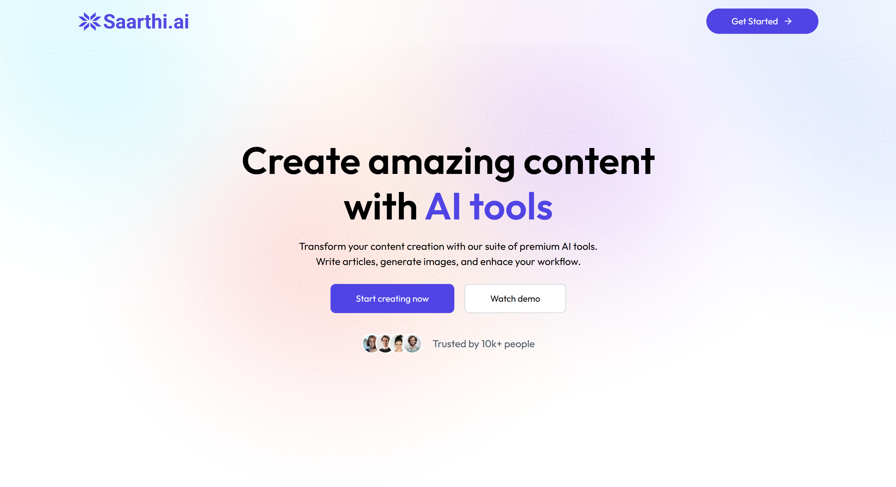
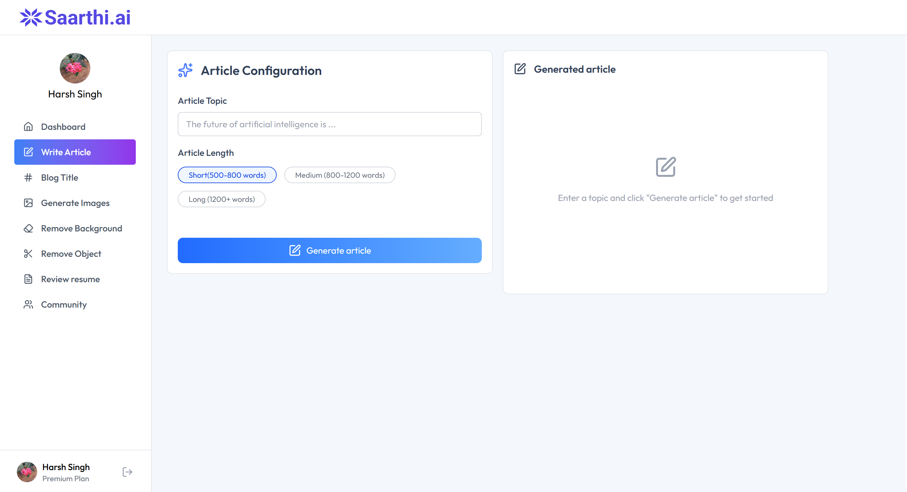
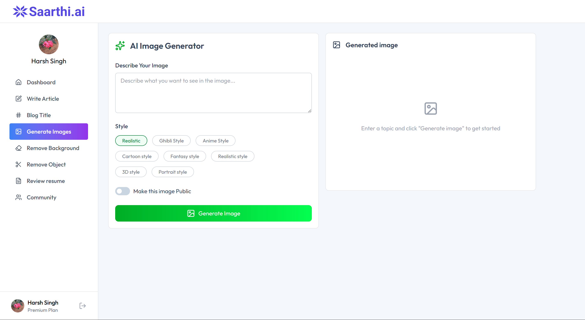
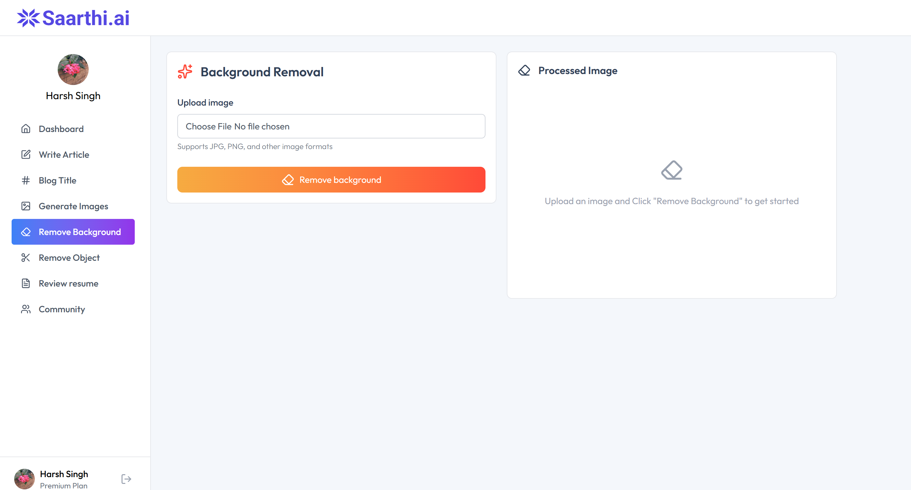
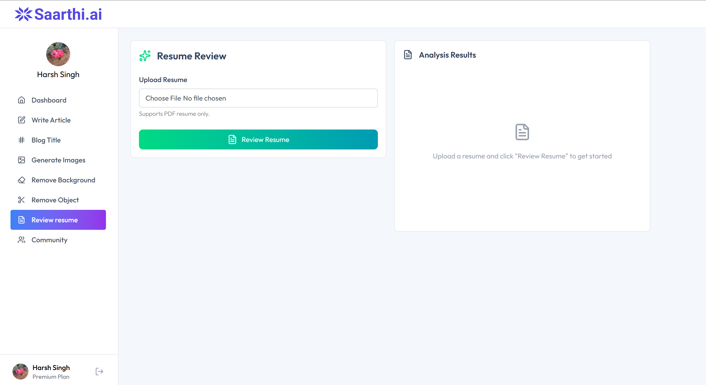
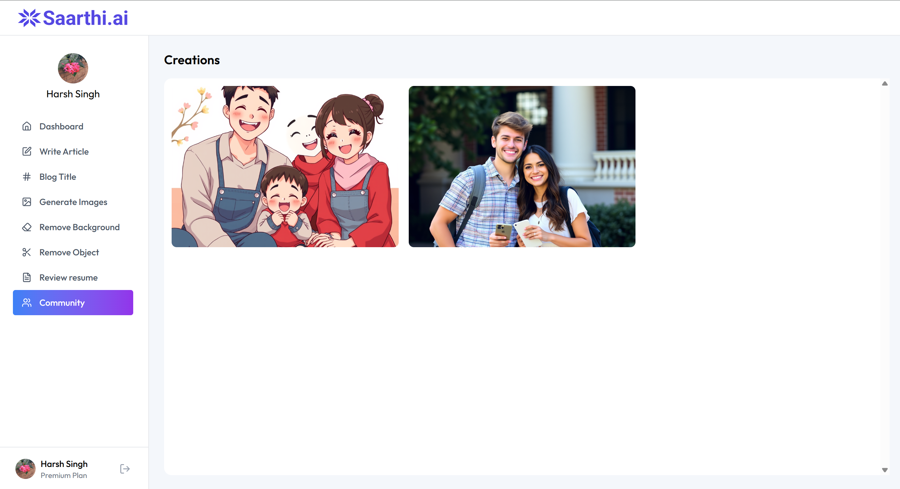

# 🚀 AI SaaS Platform

A comprehensive AI-powered SaaS application built with React and Node.js, featuring image generation, background removal, resume analysis, and community sharing.


## 🌟 Live Demo

**🔗 [Live Website](https://saarthi-ai-client.vercel.app/)**

## 📸 Screenshots

### 🏠 Homepage


### ✍️ Article Generation


### 🖼️ Image Generation


### 🗑️ Background Removal


### 📄 Resume Review


### 👥 Community


## ✨ Features

### 🎯 Core Features
- **🤖 AI Article Generation** - Generate high-quality articles using Gemini AI
- **🎨 AI Image Generation** - Create stunning images from text prompts using ClipDrop API
- **🗑️ Background Removal** - Remove backgrounds from images using Cloudinary AI
- **✂️ Object Removal** - Remove specific objects from images
- **📄 Resume Analysis** - Get AI-powered feedback on resumes
- **👥 Community Hub** - Share and discover AI-generated content

### 🔐 Authentication & Authorization
- **🔑 Clerk Authentication** - Secure user management
- **💎 Premium Subscriptions** - Tiered access to features
- **👤 User Profiles** - Personalized user experience

### 🎨 User Experience
- **📱 Responsive Design** - Works on all devices
- **🌙 Modern UI** - Clean and intuitive interface
- **⚡ Real-time Updates** - Instant feedback and notifications
- **❤️ Like System** - Community engagement features

## 🛠️ Tech Stack

### Frontend
- **⚛️ React 18** - Modern React with hooks
- **🎨 Tailwind CSS** - Utility-first CSS framework
- **🧭 React Router** - Client-side routing
- **🔔 React Hot Toast** - Beautiful notifications
- **📝 React Markdown** - Markdown rendering
- **🎯 Lucide React** - Beautiful icons
- **🚀 Vite** - Fast build tool

### Backend
- **🟢 Node.js** - JavaScript runtime
- **🚂 Express.js** - Web framework
- **🐘 PostgreSQL** - Database with Neon
- **🔐 Clerk** - Authentication
- **☁️ Cloudinary** - Image processing
- **🤖 Google Gemini AI** - Text generation
- **🎨 ClipDrop API** - Image generation
- **📁 Multer** - File upload handling

### Deployment
- **▲ Vercel** - Frontend deployment
- **🌐 Vercel** - Backend deployment
- **🐘 Neon** - PostgreSQL hosting
- **☁️ Cloudinary** - Image hosting

## 🚀 Getting Started

### Prerequisites
- Node.js 18+ installed
- PostgreSQL database
- Clerk account
- Cloudinary account
- Google AI Studio account
- ClipDrop API account

### 📦 Installation

1. **Clone the repository**
```bash
git clone https://github.com/mewillsh/saarthi-ai.git
cd saarthi-ai
```

2. **Install dependencies**
```bash
# Install server dependencies
cd server
npm install

# Install client dependencies
cd ../client
npm install
```

3. **Set up environment variables**

**Server (.env):**
```env
PORT=3000
DATABASE_URL=your_postgresql_connection_string
CLERK_PUBLISHABLE_KEY=pk_test_your_clerk_key
CLERK_SECRET_KEY=sk_test_your_clerk_secret
CLOUDINARY_CLOUD_NAME=your_cloudinary_name
CLOUDINARY_API_KEY=your_cloudinary_key
CLOUDINARY_API_SECRET=your_cloudinary_secret
CLIPDROP_API_KEY=your_clipdrop_key
GEMINI_API_KEY=your_gemini_key
```

**Client (.env):**
```env
VITE_CLERK_PUBLISHABLE_KEY=pk_test_your_clerk_key
VITE_BASE_URL=http://localhost:3000
```

4. **Set up the database**
```sql
CREATE TABLE creations (
  id SERIAL PRIMARY KEY,
  user_id TEXT NOT NULL,
  prompt TEXT NOT NULL,
  content TEXT NOT NULL,
  type TEXT NOT NULL,
  publish BOOLEAN DEFAULT false,
  likes TEXT[] DEFAULT '{}',
  created_at TIMESTAMP DEFAULT CURRENT_TIMESTAMP
);
```

5. **Run the application**
```bash
# Start server (in server directory)
npm run dev

# Start client (in client directory)
npm run dev
```

6. **Open your browser**
```
http://localhost:5173
```

## 📂 Project Structure

```
ai-saas-platform/
├── client/                 # React frontend
│   ├── src/
│   │   ├── components/     # Reusable components
│   │   ├── pages/         # Page components
│   │   ├── context/       # React context
│   │   └── main.jsx       # App entry point
│   └── package.json
├── server/                # Node.js backend
│   ├── controllers/       # Route controllers
│   ├── routes/           # API routes
│   ├── middleware/       # Custom middleware
│   ├── configs/          # Configuration files
│   └── server.js         # Server entry point
└── README.md
```

## 🔑 API Endpoints

### Authentication
```http
POST /api/user/get-user-creations    # Get user's creations
GET  /api/user/get-published-creations # Get public creations
POST /api/user/toggle-like-creation   # Like/unlike creation
```

### AI Features
```http
POST /api/ai/generate-article         # Generate article
POST /api/ai/generate-blog-title      # Generate blog titles
POST /api/ai/generate-image           # Generate images
POST /api/ai/remove-image-background  # Remove backgrounds
POST /api/ai/remove-image-object      # Remove objects
POST /api/ai/resume-review           # Analyze resumes
```

## 🌐 Deployment

### Frontend (Vercel)
1. Push code to GitHub
2. Connect repository to Vercel
3. Set environment variables in Vercel dashboard
4. Deploy automatically on push

### Backend (Railway/Render)
1. Connect repository to Railway/Render
2. Set environment variables
3. Deploy with automatic builds

## 🤝 Contributing

1. Fork the repository
2. Create your feature branch (`git checkout -b feature/AmazingFeature`)
3. Commit your changes (`git commit -m 'Add some AmazingFeature'`)
4. Push to the branch (`git push origin feature/AmazingFeature`)
5. Open a Pull Request

## 📄 License

This project is licensed under the MIT License - see the LICENSE file for details.

## 👨‍💻 Author

**Harsh Singh**
- GitHub: [@mewillsh](https://github.com/mewillsh)
- LinkedIn: [@harsh-singh](https://www.linkedin.com/in/harsh-singh-3505961b2/)

## 🙏 Acknowledgments

- [Clerk](https://clerk.dev) for authentication
- [Cloudinary](https://cloudinary.com) for image processing
- [Google AI](https://ai.google.dev) for Gemini API
- [ClipDrop](https://clipdrop.co) for image generation
- [Vercel](https://vercel.com) for hosting

## 📊 Features Status

- ✅ User Authentication
- ✅ Article Generation
- ✅ Image Generation
- ✅ Background Removal
- ✅ Object Removal
- ✅ Resume Review
- ✅ Community Features
- ✅ Like System
- 🚧 Premium Subscriptions (In Progress)
- 🔮 Advanced Analytics (Planned)

---

⭐ **If you found this project helpful, please give it a star!** ⭐

## 📞 Support

If you have any questions or issues, feel free to:
- Open an issue on GitHub
- Contact me via email
- Connect on LinkedIn

**Happy coding!** 🚀

---

## 🔧 Troubleshooting

### Common Issues

**1. Environment Variables Not Loading**
```bash
# Make sure .env files are in correct directories
# Server .env should be in /server/
# Client .env should be in /client/
```

**2. Database Connection Issues**
```bash
# Check your DATABASE_URL format
# Ensure database is accessible
```

**3. API Keys Not Working**
```bash
# Verify all API keys are valid
# Check rate limits on external APIs
```

**4. File Upload Issues**
```bash
# Check file size limits
# Verify file types are allowed
```

## 🎯 Roadmap

- [ ] Payment integration (Stripe)
- [ ] Advanced user analytics
- [ ] API rate limiting
- [ ] Email notifications
- [ ] Mobile app (React Native)
- [ ] Multi-language support
- [ ] Advanced AI models integration

Similar code found with 1 license type
